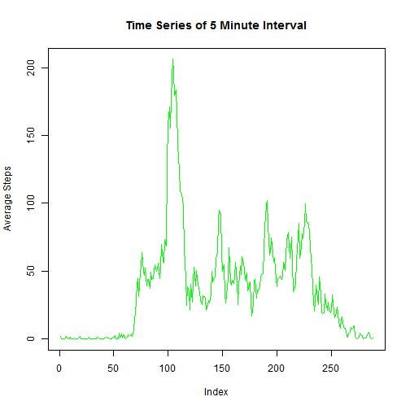

##Loading and Preprocessing the Data 


```r
rm(list=ls(all=TRUE))
library(lubridate)
library(lattice)
data<-read.csv("C:/Users/dhaead/Documents/repdata_data_activity/activity.csv")
data<-subset(data,complete.cases(data)==TRUE)
data2<-read.csv("C:/Users/dhaead/Documents/repdata_data_activity/activity.csv")
mean_days<-tapply(data$steps,data$date,mean)#take the mean of step over each day
sums_days<-tapply(data$steps,data$date,sum)#take the sum of steps over all days

days<-weekdays(as.POSIXct(data2$date),abbreviate=TRUE)
days<-gsub("Sat","Weekend",days)
days<-gsub("Sun","Weekend",days)
days<-gsub("Mon","Weekday",days)
days<-gsub("Tue","Weekday",days)
days<-gsub("Wed","Weekday",days)
days<-gsub("Thu","Weekday",days)
days<-gsub("Fri","Weekday",days)

data2<-cbind(data2,days)
```
##Mean and Median of the Total Steps Taken Each Day
A histogram of the total number of steps shows a nearly normal distribution of the total number of steps taken over the days

```r
hist(sums_days,xlab = "Total Steps Each Day",main = "Total Steps By Day")#plot a histogram
```

 

We see from the summary statistics that the mean and median values are 10,770 and 10760 respectively.


```r
summary(sums_days) #summary statistics
```

```
##    Min. 1st Qu.  Median    Mean 3rd Qu.    Max.    NA's 
##      41    8841   10760   10770   13290   21190       8
```

Taking the mean for each five minute interval and ploting a timeseries of the data we can see the distribution has a well defined peak of about 200 near Index 100.


```r
splint <- split(data,data$interval, drop=TRUE)     # split data by interval  
intavg <- sapply(splint, function(x) mean(x$steps))     #average on each interval   
plot(intavg, type="l",  
     main="Time Series of 5 Minute Interval", 
     ylab="Average Steps", 
     xlab="Index", col="green")                                 
```

 

We see from the summary statistics that the maximum value for the mean of steps taken per five minute interval for all days is aproximately 206.2


```r
summary(intavg)
```

```
##    Min. 1st Qu.  Median    Mean 3rd Qu.    Max. 
##   0.000   2.486  34.110  37.380  52.830 206.200
```

This maximum average corresponds to the interval 835.


```r
names(which.max(intavg)) 
```

```
## [1] "835"
```

##Imputing NA's
For this scheme the mean was taken accross each day and calculating summary statistics of that gave the value of 37.38 steps taken on average. This value was used to fill in the NA values in the data set.


```r
data2[is.na(data2)] <- summary(mean_days)[4] #
summary(data2)
```

```
##      steps                date          interval           days      
##  Min.   :  0.00   2012-10-01:  288   Min.   :   0.0   Weekday:12960  
##  1st Qu.:  0.00   2012-10-02:  288   1st Qu.: 588.8   Weekend: 4608  
##  Median :  0.00   2012-10-03:  288   Median :1177.5                  
##  Mean   : 37.38   2012-10-04:  288   Mean   :1177.5                  
##  3rd Qu.: 37.38   2012-10-05:  288   3rd Qu.:1766.2                  
##  Max.   :806.00   2012-10-06:  288   Max.   :2355.0                  
##                   (Other)   :15840
```

Looking at a histogram of the data with NA values replaced we see that the mean and median now coincide more closely than in the case were NA's were not filled in. We also see the peak data has become more well defined. In other words the impact of filling in NA values is the increase in the frequency of the total number of steps taken from about 25 to about 35 where the total number of steps is about 13,000.


```r
sums_days2<-tapply(data2$steps,data2$date,sum)#take the sum of steps over all each day
mean_days2<-tapply(data2$steps,data2$date,mean)#take the mean of step over each day
summary(sums_days2) #summary statistics of the sum taken over each day
```

```
##    Min. 1st Qu.  Median    Mean 3rd Qu.    Max. 
##      41    9819   10770   10770   12810   21190
```

```r
hist(sums_days2,xlab = "Total Steps Each Day",main = "Total Steps By Day")#plot a histogram of the sums taken over each day
```

 


Comparing weekdays to weekends, we can see that the average steps taken over the weekends tends to be more a little more uniformly distributed. We see that during a specific time interval during weekdays that the is a well defined peak in the average steps taken which corresponds to about 200 steps taken during the 835 interval.


```r
tidy <- aggregate(data2$steps ~ data2$interval + data2$days,data2, mean)
names(tidy)<-c("interval","day","steps")


xyplot(steps ~ interval|day,data=tidy,type='l',layout=c(1,2))
```

 
